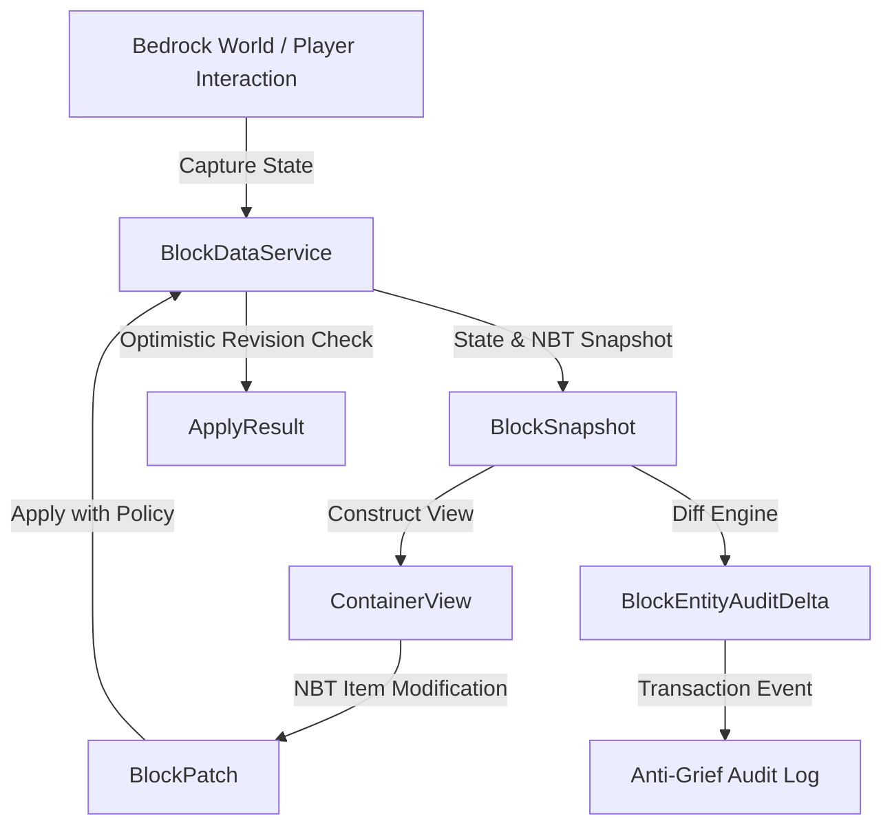

# Endstone BlockData API

[](https://github.com/TheNINJALLO/endstone-blockdata-api/releases/tag/v0.4.5-beta.8)
[](https://github.com/EndstoneMC/endstone)
[](https://www.minecraft.net/en-us/download/server/bedrock)
[](https://github.com/TheNINJALLO/endstone-blockdata-api/actions)
[](#-direct-release-downloads-v045-beta8)
[](#-c--python-api-quickstart)
[](LICENSE)

A high-performance, detached **Block State**, **Block Entity**, and **Canonical NBT** manipulation API for Endstone Bedrock Dedicated Servers (BDS).

Designed for complex inventory handling, container snapshots, anti-grief transaction diffing, and live block trait modification without risking world corruption or looper thread lockups.

---

## 📚 Documentation & Technical Wiki

Comprehensive guides, architecture diagrams, container audit tutorials, and full API specifications are available on the [**Docsify Documentation Site**](docs/README.md).

---

## 📦 Direct Release Downloads (`v0.4.5-beta.8`)

| Platform | BDS Version | Artifact Filename | Direct Download |
| :--- | :--- | :--- | :--- |
| **Windows x64** | `1.26.32` | `endstone-blockdata-api-v0.4.5-beta.8-bds-1.26.32-windows-x64.dll` | [Download](https://github.com/TheNINJALLO/endstone-blockdata-api/releases/download/v0.4.5-beta.8/endstone-blockdata-api-v0.4.5-beta.8-bds-1.26.32-windows-x64.dll) |
| **Windows x64** | `1.26.33` | `endstone-blockdata-api-v0.4.5-beta.8-bds-1.26.33-windows-x64.dll` | [Download](https://github.com/TheNINJALLO/endstone-blockdata-api/releases/download/v0.4.5-beta.8/endstone-blockdata-api-v0.4.5-beta.8-bds-1.26.33-windows-x64.dll) |
| **Linux x64** | `1.26.32` | `endstone-blockdata-api-v0.4.5-beta.8-bds-1.26.32-linux-x64.so` | [Download](https://github.com/TheNINJALLO/endstone-blockdata-api/releases/download/v0.4.5-beta.8/endstone-blockdata-api-v0.4.5-beta.8-bds-1.26.32-linux-x64.so) |
| **Linux x64** | `1.26.33` | `endstone-blockdata-api-v0.4.5-beta.8-bds-1.26.33-linux-x64.so` | [Download](https://github.com/TheNINJALLO/endstone-blockdata-api/releases/download/v0.4.5-beta.8/endstone-blockdata-api-v0.4.5-beta.8-bds-1.26.33-linux-x64.so) |
| **Python Wheel** | `Universal` | `endstone_blockdata_inspector-0.4.5b8-py3-none-any.whl` | [Download](https://github.com/TheNINJALLO/endstone-blockdata-api/releases/download/v0.4.5-beta.8/endstone_blockdata_inspector-0.4.5b8-py3-none-any.whl) |

---

## 🏛️ Architecture Overview



---

## ⚡ Quickstart Code Examples

### Python API Example
```python
from endstone_blockdata import BlockDataService, ContainerView, ConflictPolicy

service = BlockDataService()

# 1. Capture block state & NBT snapshot
snapshot = service.capture("overworld", (100, 64, 200))
print(f"Block: {snapshot.type}, Revision: {snapshot.revision}")

# 2. Inspect & Modify Container NBT
if snapshot.block_entity:
    view = ContainerView(snapshot)
    # Insert custom item with NBT into slot 0
    patch = view.patch_item(0, {
        "id": "minecraft:diamond_sword",
        "count": 1,
        "tag": {"display": {"Name": "§6Excalibur"}}
    })
    result = service.apply(patch, ConflictPolicy.FORCE)
    print(f"Apply Status: {result.status}")
```

### C++ API Example
```cpp
#include <endstone_blockdata/endstone_adapter.h>
#include <endstone/endstone.hpp>

void onContainerTouch(endstone::Server& server) {
    auto* service = server.getServiceManager().getService<endstone_blockdata::BlockDataService>();
    if (service) {
        auto snap = service->capture("overworld", {100, 64, 200});
        // Mutate block properties
    }
}
```

---

## 🎮 In-Game Inspector Test Suite (`/bd`)

The repository includes a packaged Python wheel test plugin [`endstone_blockdata_inspector`](examples/python/block_data_inspector_plugin/):

```bash
# Installation via pip in Endstone Python environment:
pip install endstone_blockdata_inspector-0.4.5a9-py3-none-any.whl
```

### In-Game Command Reference
| Command | Usage | Description |
| :--- | :--- | :--- |
| `/bd locate [radius]` | `/bd locate 10` | Scans bounding box around player for all container block entities. |
| `/bd inspect [x] [y] [z]` | `/bd inspect 100 64 200` | Displays block runtime ID, state traits, revision, and canonical NBT inventory. |
| `/bd item add <slot> <id> [cnt] [nbt]` | `/bd item add 0 diamond 64` | Inserts item with custom NBT into target container slot. |
| `/bd item remove <slot>` | `/bd item remove 0` | Clears item from target slot using an NBT removal patch. |
| `/bd audit <start\|stop\|history>` | `/bd audit start` | Records container baseline and generates transaction change diffs. |
| `/bd state set <prop> <val>` | `/bd state set facing south` | Mutates a block state property in real-time. |

---

## 📚 Documentation & Wiki

Full technical documentation, architecture deep dives, and API reference manuals are available in the project Wiki:

- 📖 [Documentation Index](docs/README.md)
- 🏗️ [Architecture & Memory Model](docs/ARCHITECTURE.md)
- 📦 [Canonical NBT & Container Systems](docs/nbt_and_containers.md)
- 🛡️ [Container Transaction Audit Engine](docs/audit_system.md)
- 📘 [Complete API Reference](docs/api_reference.md)
- 💡 [Code Examples & Recipes](examples/python/)

---

## 📜 License

Distributed under the [MIT License](LICENSE).
