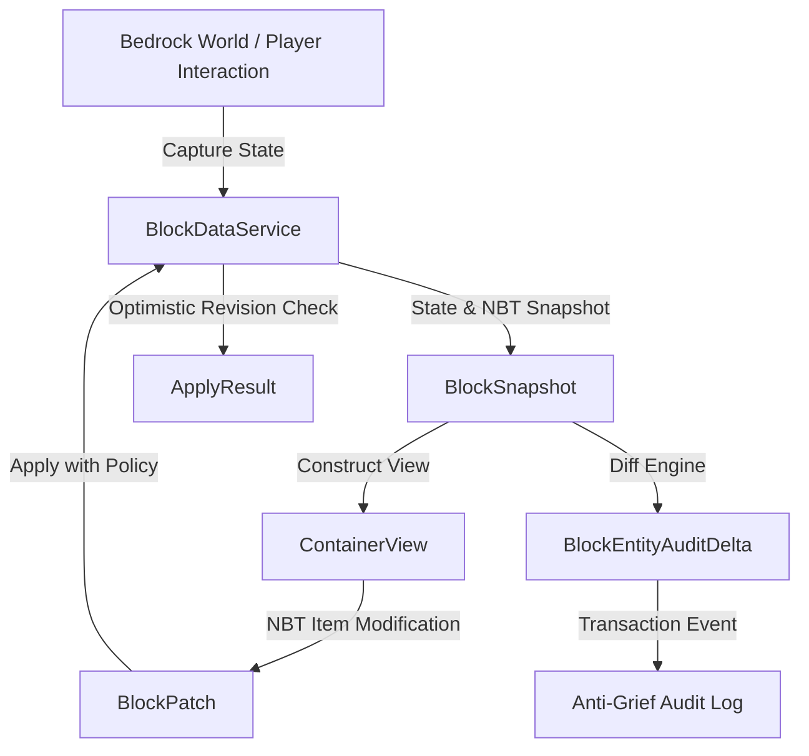

# Endstone BlockData API

[](https://github.com/TheNINJALLO/endstone-blockdata-api/releases/tag/v0.5.2)
[](https://github.com/EndstoneMC/endstone)
[](https://www.minecraft.net/en-us/download/server/bedrock)
[](https://github.com/TheNINJALLO/endstone-blockdata-api/actions)
[](#-direct-release-downloads-v051)
[](#-c--python-api-quickstart)
[](LICENSE)

A high-performance, detached **Block State**, **Block Entity**, and **Canonical NBT** manipulation API for Endstone Bedrock Dedicated Servers (BDS).

Designed for complex inventory handling, container snapshots, anti-grief transaction diffing, and live block trait modification without risking world corruption or looper thread lockups.

---

## 📚 Documentation & Technical Wiki

Comprehensive guides, architecture diagrams, container audit tutorials, and full API specifications are available on the [**Docsify Documentation Site**](docs/README.md).

---

## 📦 Direct Release Downloads (`v0.5.2`)

Use the **complete ZIP** matching BDS 1.26.40 and the server platform. It contains both the native plugin and the matching self-contained `/bd` command wheel. The raw library is for native-API-only/manual installations.

| Platform | BDS Version | Artifact Filename | Direct Download |
| :--- | :--- | :--- | :--- |
| **Windows x64 ZIP (recommended)** | `1.26.40` | `endstone-blockdata-api-v0.5.2-bds-1.26.40-windows-x64.zip` | [Download](https://github.com/TheNINJALLO/endstone-blockdata-api/releases/download/v0.5.2/endstone-blockdata-api-v0.5.2-bds-1.26.40-windows-x64.zip) |
| **Linux x64 ZIP (recommended)** | `1.26.40` | `endstone-blockdata-api-v0.5.2-bds-1.26.40-linux-x64.zip` | [Download](https://github.com/TheNINJALLO/endstone-blockdata-api/releases/download/v0.5.2/endstone-blockdata-api-v0.5.2-bds-1.26.40-linux-x64.zip) |
| **Windows x64 raw plugin** | `1.26.40` | `endstone-blockdata-api-v0.5.2-bds-1.26.40-windows-x64.dll` | [Download](https://github.com/TheNINJALLO/endstone-blockdata-api/releases/download/v0.5.2/endstone-blockdata-api-v0.5.2-bds-1.26.40-windows-x64.dll) |
| **Linux x64 raw plugin** | `1.26.40` | `endstone-blockdata-api-v0.5.2-bds-1.26.40-linux-x64.so` | [Download](https://github.com/TheNINJALLO/endstone-blockdata-api/releases/download/v0.5.2/endstone-blockdata-api-v0.5.2-bds-1.26.40-linux-x64.so) |
| **Windows `/bd` wheel** | `CPython 3.14` | `endstone_blockdata_inspector-0.5.2-cp314-cp314-win_amd64.whl` | [Download](https://github.com/TheNINJALLO/endstone-blockdata-api/releases/download/v0.5.2/endstone_blockdata_inspector-0.5.2-cp314-cp314-win_amd64.whl) |
| **Linux `/bd` wheel** | `CPython 3.14` | `endstone_blockdata_inspector-0.5.2-cp314-cp314-linux_x86_64.whl` | [Download](https://github.com/TheNINJALLO/endstone-blockdata-api/releases/download/v0.5.2/endstone_blockdata_inspector-0.5.2-cp314-cp314-linux_x86_64.whl) |

---

## 🏛️ Architecture Overview


```mermaid
graph TD
    A[Bedrock World / Player Interaction] -->|Capture State| B[BlockDataService]
    B -->|State & NBT Snapshot| C[BlockSnapshot]
    C -->|Construct View| D[ContainerView]
    D -->|NBT Item Modification| E[BlockPatch]
    E -->|Apply with Policy| B
    B -->|Optimistic Revision Check| F[ApplyResult]
    C -->|Diff Engine| G[BlockEntityAuditDelta]
    G -->|Transaction Event| H[Anti-Grief Audit Log]
```

---

## ⚡ Quickstart Code Examples

### Python API Example
```python
from endstone_blockdata import (
    BlockDataService,
    ContainerView,
    ConflictPolicy,
    LiveBlockDataAdapter,
)

# Inside an Endstone plugin, self.server is the live server instance.
service = BlockDataService(LiveBlockDataAdapter(self.server))

# 1. Capture block state & NBT snapshot
snapshot = service.capture("overworld", (100, 64, 200))
print(f"Block: {snapshot.type}, Revision: {snapshot.revision}")

# 2. Inspect & Modify Container NBT
if snapshot.block_entity:
    view = ContainerView(snapshot)
    # Insert custom item with NBT into slot 0
    patch = view.patch_item(0, {
        "Name": "minecraft:diamond_sword",
        "Count": 1,
        "tag": {"display": {"Name": "§6Excalibur"}}
    })
    result = service.apply(patch, ConflictPolicy.FAIL_IF_CHANGED)
    print(f"Apply Status: {result.status}")
```

### C++ API Example
```cpp
#include <endstone_blockdata/live_service.h>
#include <endstone/endstone.hpp>
#include <string>

void onContainerTouch(endstone::Server &server) {
    using namespace endstone_blockdata;
    auto service = server.getServiceManager().load<LiveBlockDataService>(
        std::string(BlockDataServiceName));
    if (!service) return;  // The native BlockData plugin is not enabled.

    BlockLocation location{"overworld", 100, 64, 200};
    auto snapshot = service->capture(location);
    if (!snapshot) return;

    BlockPatch patch;
    patch.location = location;
    patch.expected_revision = snapshot->revision;
    patch.state_updates["minecraft:cardinal_direction"] = std::string("north");
    auto result = service->apply(patch, ConflictPolicy::FailIfChanged);
    if (!result.ok()) {
        server.getLogger().warning("BlockData apply failed: {}", result.message);
    }
}
```

---

## 🎮 In-Game Inspector Test Suite (`/bd`)

The repository includes the [`endstone_blockdata_inspector`](examples/python/block_data_inspector_plugin/) command plugin. Choose the platform-specific **CPython 3.14** wheel from the same exact build as the native plugin; its `_endstone_blockdata_live` bridge is bundled inside the wheel.

Stop the server and remove older BlockData inspector wheels before copying v0.5.2; leaving multiple versions in `plugins/` can make Endstone install them in an undefined order.

```bash
# Linux example: copy both files from the complete ZIP's plugins/ directory.
cp endstone_blockdata_bds_1_26_40.so /path/to/endstone/plugins/
cp endstone_blockdata_inspector-0.5.2-cp314-cp314-linux_x86_64.whl /path/to/endstone/plugins/
```

### In-Game Command Reference
| Command | Usage | Description |
| :--- | :--- | :--- |
| `/bd` or `/bd menu` | `/bd menu` | Opens the guarded in-game menu with navigation for every command below. |
| `/bd locate [radius]` | `/bd locate 10` | Uses native region capture to find live container block entities. |
| `/bd inspect [x] [y] [z]` | `/bd inspect 100 64 200` | Displays state, revision, a bounded canonical-NBT preview, capacity, and occupied inventory. |
| `/bd item add <slot> <id> [cnt] [nbt]` | `/bd item add 0 diamond 64` | Writes a live item with optimistic revision checking. |
| `/bd item remove <slot>` | `/bd item remove 0` | Clears a live item with optimistic revision checking. |
| `/bd audit <start\|stop\|history>` | `/bd audit start` | Captures and compares live native snapshots. |
| `/bd state set <prop> <val>` | `/bd state set facing south` | Writes a live block-state property. |

The menu allows only one BlockData form per player, validates every submitted
field, and asks for confirmation before inventory or state writes. Closing a
submenu navigates back; disconnect, death, plugin shutdown, or form-send failure
releases its lock. Typed commands remain available, and the console receives the
text help because Bedrock forms are player-only.

---

## 📚 Documentation & Wiki

Full technical documentation, architecture deep dives, and API reference manuals are available in the project Wiki:

- 📖 [Documentation Index](docs/README.md)
- 🏗️ [Architecture & Memory Model](docs/ARCHITECTURE.md)
- 📦 [Canonical NBT & Container Systems](docs/nbt_and_containers.md)
- 🎒 [Bundle & Storage Item Module](docs/storage_items.md)
- 🛒 [Live Shelf API and Shop Example](docs/shelves.md)
- 🧍 [Player Inventory Adapter](docs/player_inventory.md)
- 🛡️ [Container Transaction Audit Engine](docs/audit_system.md)
- 📘 [Complete API Reference](docs/api_reference.md)
- 💡 [Code Examples & Recipes](examples/python/)

---

## 📜 License

Distributed under the [Apache License 2.0](LICENSE).
